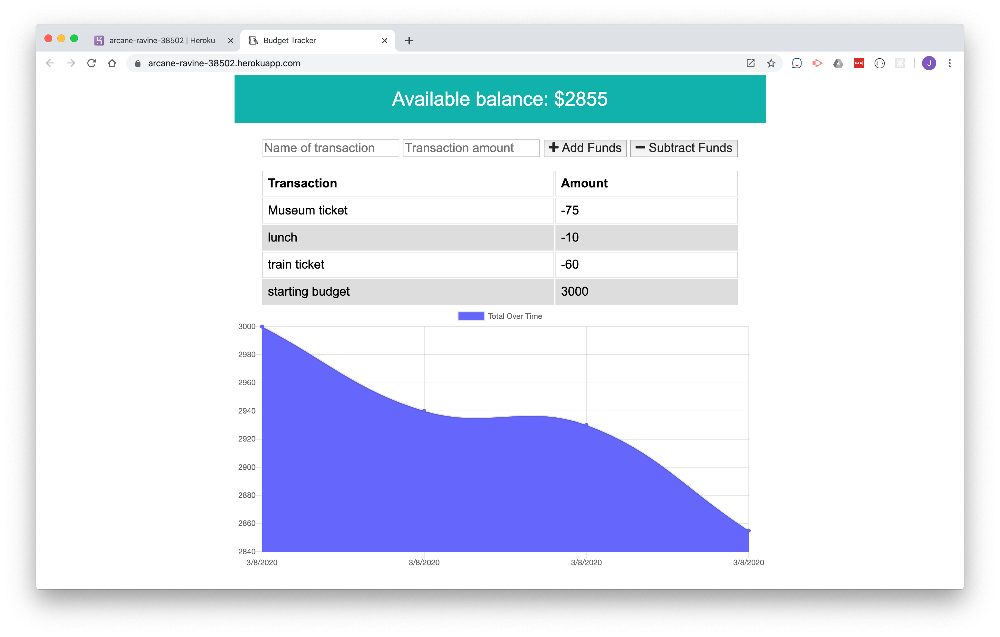

# Budget Tracker PWA
Budget Tracker is a progressive web app that allows users to access basic budget tracking functionality whether or not they are connected to the Internet. Start by adding an initial budget and then enter expenses as they occur.

## Deployed URL
https://arcane-ravine-38502.herokuapp.com/

## Screenshot

## To Install
Desktop: open deployed app in Chrome; click install button in the address bar
Mobile: click share button, then select Add to Home Screen (iOS)
